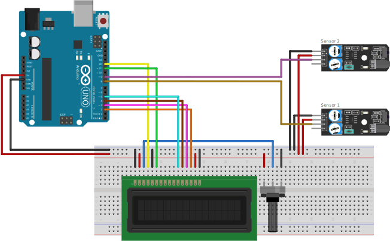

# Hot Wheels Speed Meter
<div style="display: inline_block">
  
</div>

Um medidor de de velocidade para carrinhos em minuattura

## Uso

No código alterar o valor da variável ```distancia``` para a distância entre os dois sensores de proximidade em milimetros.

### Componentes

1 x Arduino Uno;
1 x Display 16x2;
1 x Potenciometro de 10kΩ;
2 x Sensor de Obstáculos Reflexivo Infravermelho KY-032;
1 x Protoboard;
Jumpers para protoboard.

### Montagem eletrônica



